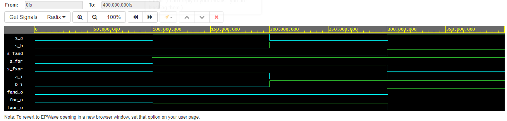

# LAB 01-gates

### Link to EDA PlayGround
[EDA PlayGroud](https://www.edaplayground.com/x/GcJv)
### Link to GitHub repository
[GitHub repository](https://github.com/amwellius/Digital-electronics-1)


## Part 3: EDA Playground
### Example of basic gates

### De Morgan's laws


| **c** | **b** |**a** | **f(c,b,a)** |
| :-: | :-: | :-: | :-: |
| 0 | 0 | 0 | 1 |
| 0 | 0 | 1 | 1 |
| 0 | 1 | 0 | 0 |
| 0 | 1 | 1 | 0 |
| 1 | 0 | 0 | 0 |
| 1 | 0 | 1 | 1 |
| 1 | 1 | 0 | 0 |
| 1 | 1 | 1 | 0 |


## Experiments on your own
### Boolean postulates

### VHDL CODE design.vhd
```vhdl
------------------------------------------------------------------------
--
-- Example of basic OR, AND, XOR gates.
-- Nexys A7-50T, Vivado v2020.1, EDA Playground
--
-- Copyright (c) 2019-2020 Tomas Fryza
-- Dept. of Radio Electronics, Brno University of Technology, Czechia
-- This work is licensed under the terms of the MIT license.
--
------------------------------------------------------------------------

library ieee;               -- Standard library
use ieee.std_logic_1164.all;-- Package for data types and logic operations

------------------------------------------------------------------------
-- Entity declaration for basic gates
------------------------------------------------------------------------
entity gates is
    port(
        a_i    : in  std_logic;         -- Data input
        b_i    : in  std_logic;         -- Data input
        c_i    : in  std_logic;         -- Data input
        for_o  : out std_logic;      	-- OR output function
        fand_o : out std_logic;        	-- AND output function
        fxor_o : out std_logic;        	-- XOR output function
        
        fnor_o  : out std_logic;        -- OR output function
        fnand_o : out std_logic;        -- AND output function
        f_o 	: out std_logic;        -- De Morgan's Law output function
        
        x1_o	: out std_logic;		-- out for EOYO 1 
        x2_o	: out std_logic;		-- out for EOYO 1 
        x3_o	: out std_logic;		-- out for EOYO 1 
        x4_o	: out std_logic;		-- out for EOYO 1 
        
        y1_o	: out std_logic;		-- out for EOYO 2 
        y2_o	: out std_logic;		-- out for EOYO 2 
        y3_o	: out std_logic;		-- out for EOYO 2 
        y4_o	: out std_logic			-- out for EOYO 2 
        
        
    );
end entity gates;

------------------------------------------------------------------------
-- Architecture body for basic gates
------------------------------------------------------------------------
architecture dataflow of gates is
begin
--PART 1
    for_o  <= a_i or b_i;
    fand_o <= a_i and b_i;
    fxor_o <= a_i xor b_i;

--PART 3
--De Morgan's Law
	
    f_o			<= (not(b_i) and a_i) or (not(c_i) and not(b_i));						--De Morgan
    fnand_o 	<= not((not ((not b_i) and a_i)) and not((not c_i) and(not b_i)));		--and
    fnor_o		<= (not(b_i or (not a_i))) or (not (c_i or b_i));						--or
    
--EOYO
--1
	
    x1_o	<= a_i and not(a_i);		--x*~x 	= 0
    x2_o	<= a_i or not(a_i);			--x+~x 	= 1
    x3_o	<= a_i or a_i or a_i;		--x+x+x = x
    x4_o	<= a_i and a_i and a_i;		--x*x*x = 0

--2
	
    y1_o	<= (a_i and b_i) or (a_i and c_i);		--x*y + x*z
    y2_o	<= a_i and (b_i or c_i);				--x * (y+z)
    y3_o	<= (a_i or b_i) and (a_i or c_i);		--(x+y) * (x+z)
    y4_o	<= a_i or (b_i and c_i);				--x + (y*z)
    
    
    

end architecture dataflow;
```
### VHDL CODE testbench.vhd
```vhdl
------------------------------------------------------------------------
--
-- Testbench for basic gates circuit.
-- Nexys A7-50T, Vivado v2020.1, EDA Playground
--
-- Copyright (c) 2020 Tomas Fryza
-- Dept. of Radio Electronics, Brno University of Technology, Czechia
-- This work is licensed under the terms of the MIT license.
--
------------------------------------------------------------------------

library ieee;
use ieee.std_logic_1164.all;

------------------------------------------------------------------------
-- Entity declaration for testbench
------------------------------------------------------------------------
entity tb_gates is
    -- Entity of testbench is always empty
end entity tb_gates;

------------------------------------------------------------------------
-- Architecture body for testbench
------------------------------------------------------------------------
architecture testbench of tb_gates is

    -- Local signals
    signal s_a   	: std_logic;
    signal s_b    	: std_logic;
    signal s_c    	: std_logic;
    
    signal s_for  	: std_logic;
    signal s_fand 	: std_logic;
    signal s_fxor 	: std_logic;
    
    signal s_fnor	: std_logic;
    signal s_fnand	: std_logic;
    signal s_fo		: std_logic;
    
    signal s_x1		:std_logic;
    signal s_x2		:std_logic;
    signal s_x3		:std_logic;
    signal s_x4		:std_logic;
    
    signal s_y1		:std_logic;
    signal s_y2		:std_logic;
    signal s_y3		:std_logic;
    signal s_y4		:std_logic;

begin
    -- Connecting testbench signals with gates entity (Unit Under Test)
    uut_gates : entity work.gates
        port map(
            a_i    	=> s_a,
            b_i    	=> s_b,
            c_i    	=> s_c,
            
            for_o  	=> s_for,
            fand_o 	=> s_fand,
            fxor_o 	=> s_fxor,
            
            fnor_o  => s_fnor,
            fnand_o => s_fnand,
            f_o 	=> s_fo,
            
            x1_o	=> s_x1,
            x2_o	=> s_x2,
            x3_o	=> s_x3,
            x4_o	=> s_x4,
            
            y1_o	=> s_y1,
            y2_o	=> s_y2,
            y3_o	=> s_y3,
            y4_o	=> s_y4
        );

    --------------------------------------------------------------------
    -- Data generation process
    --------------------------------------------------------------------
    p_stimulus : process
    begin						-- Set input values and wait for 100 ns
    	s_c <= '0';
        s_b <= '0';             
        s_a <= '0';
        wait for 100 ns;
        s_c <= '0';
        s_b <= '0';
        s_a <= '1';
        wait for 100 ns;
        s_c <= '0';
        s_b <= '1';
        s_a <= '0';
        wait for 100 ns;
        s_c <= '0';
        s_b <= '1';
        s_a <= '1';
        wait for 100 ns;
        s_c <= '1';
        s_b <= '0';
        s_a <= '0';
        wait for 100 ns;
        s_c <= '1';
        s_b <= '0';
        s_a <= '1';
        wait for 100 ns;
        s_c <= '1';
        s_b <= '1';
        s_a <= '0';
        wait for 100 ns;
        s_c <= '1';
        s_b <= '1';
        s_a <= '1';
        wait for 100 ns;
        wait;                   -- Process is suspended forever
    end process p_stimulus;

end architecture testbench;

```

##### Link to EDA PlayGround
[EDA PlayGroud](https://www.edaplayground.com/x/GcJv)


### Distributive laws


##### Link to EDA PlayGround
[EDA PlayGroud](https://www.edaplayground.com/x/GcJv)
