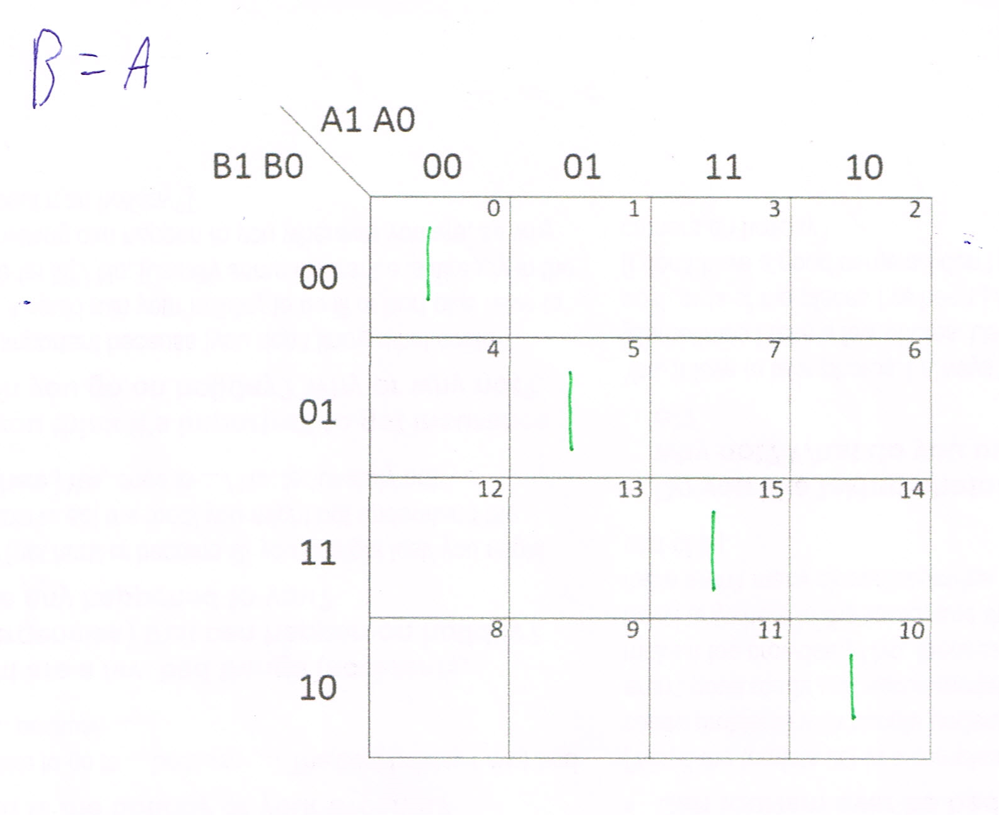

# LAB 02-logic

### Link to EDA PlayGround
[EDA PlayGroud](https://www.edaplayground.com/x/ptjA)
### Link to GitHub repository
[GitHub repository](https://github.com/amwellius/Digital-electronics-1)


## Part 1: Preparation tasks
### Binary comparator truth table

| **n** | **B[1:0]** | **A[1:0]** | **B > A** | **B = A** | **B < A** |
| :-: | :-: | :-: | :-: | :-: | :-: |
| 0 | 0 0 | 0 0 | 0 | 1 | 0 |
| 1 | 0 0 | 0 1 | 0 | 0 | 1 |
| 2 | 0 0 | 1 0 | 0 | 0 | 1 |
| 3 | 0 0 | 1 1 | 0 | 0 | 1 |
| 4 | 0 1 | 0 0 | 1 | 0 | 0 |
| 5 | 0 1 | 0 1 | 0 | 1 | 0 |
| 6 | 0 1 | 1 0 | 0 | 0 | 1 |
| 7 | 0 1 | 1 1 | 0 | 0 | 1 |
| 8 | 1 0 | 0 0 | 1 | 0 | 0 |
| 9 | 1 0 | 0 1 | 1 | 0 | 0 |
| 10 | 1 0 | 1 0 | 0 | 1 | 0 |
| 11 | 1 0 | 1 1 | 0 | 0 | 1 |
| 12 | 1 1 | 0 0 | 1 | 0 | 0 |
| 13 | 1 1 | 0 1 | 1 | 0 | 0 |
| 14 | 1 1 | 1 0 | 1 | 0 | 0 |
| 15 | 1 1 | 1 1 | 0 | 1 | 0 |


## Part 2: A 2-bit comparator
### MAP1
### B > A


### MAP2
### B = A



### MAP2
### B < A


## Part 3: A 4-bit binary comparator
### VHDL CODE design.vhd
```vhdl
library ieee;
use ieee.std_logic_1164.all;

------------------------------------------------------------------------
-- Entity declaration for 4-bit binary comparator
------------------------------------------------------------------------
entity comparator_4bit is
    port(
        a_i           : in  std_logic_vector(4 - 1 downto 0);
        b_i           : in  std_logic_vector(4 - 1 downto 0);


        -- COMPLETE ENTITY DECLARATION


        B_less_A_o    	: out std_logic;       -- B is less than A
        B_greater_A_o 	: out std_logic;       -- B is greater than A
        B_equals_A_o    : out std_logic        -- B equals A
    );
end entity comparator_4bit;

------------------------------------------------------------------------
-- Architecture body for 4-bit binary comparator
------------------------------------------------------------------------
architecture Behavioral of comparator_4bit is
begin
    B_less_A_o  	 <= '1' when (b_i < a_i) else '0';
    B_greater_A_o  	 <= '1' when (b_i > a_i) else '0';
    B_equals_A_o   	 <= '1' when (b_i = a_i) else '0';    


    -- WRITE "GREATER" AND "EQUALS" ASSIGNMENTS HERE


end architecture Behavioral;

```
### VHDL CODE testbench.vhd
```vhdl
library ieee;
use ieee.std_logic_1164.all;

------------------------------------------------------------------------
-- Entity declaration for testbench
------------------------------------------------------------------------
entity tb_comparator_4bit is
    -- Entity of testbench is always empty
end entity tb_comparator_4bit;

------------------------------------------------------------------------
-- Architecture body for testbench
------------------------------------------------------------------------
architecture testbench of tb_comparator_4bit is

    -- Local signals
    signal s_a       	 : std_logic_vector(4 - 1 downto 0);
    signal s_b       	 : std_logic_vector(4 - 1 downto 0);
    signal s_B_greater_A : std_logic;
    signal s_B_equals_A  : std_logic;
    signal s_B_less_A    : std_logic;

begin
    -- Connecting testbench signals with comparator_4bit entity (Unit Under Test)
    uut_comparator_4bit : entity work.comparator_4bit
        port map(
            a_i           => s_a,
            b_i           => s_b,
            B_greater_A_o => s_B_greater_A,
            B_equals_A_o  => s_B_equals_A,
            B_less_A_o    => s_B_less_A
        );

    --------------------------------------------------------------------
    -- Data generation process
    --------------------------------------------------------------------
    p_stimulus : process
    begin
        -- Report a note at the begining of stimulus process
        report "Stimulus process started" severity note;


        -- 0 test values
        s_b <= "0000"; s_a <= "0000"; wait for 100 ns;        
        -- Expected output
        assert ((s_B_greater_A = '0') and (s_B_equals_A = '1') and (s_B_less_A = '0'))        
        -- If false, then report an error
        report "Test failed for input combination: 0000, 0000" severity error;
        
        -- 1 test values
        s_b <= "0000"; s_a <= "0001"; wait for 100 ns;        
        -- Expected output
        assert ((s_B_greater_A = '0') and (s_B_equals_A = '0') and (s_B_less_A = '1'))        
        -- If false, then report an error
        report "Test failed for input combination: 0000, 0001" severity error;
        
        -- 2 test values
        s_b <= "0000"; s_a <= "0010"; wait for 100 ns;        
        -- Expected output
        assert ((s_B_greater_A = '0') and (s_B_equals_A = '0') and (s_B_less_A = '1'))        
        -- If false, then report an error
        report "Test failed for input combination: 0000, 0010" severity error;
        
        -- 3 test values
        s_b <= "0000"; s_a <= "0011"; wait for 100 ns;        
        -- Expected output
        assert ((s_B_greater_A = '0') and (s_B_equals_A = '0') and (s_B_less_A = '1'))        
        -- If false, then report an error
        report "Test failed for input combination: 0000, 0011" severity error;
        
        -- 4 test values
        s_b <= "0001"; s_a <= "0000"; wait for 100 ns;        
        -- Expected output
        assert ((s_B_greater_A = '1') and (s_B_equals_A = '0') and (s_B_less_A = '0'))        
        -- If false, then report an error
        report "Test failed for input combination: 0001, 0000" severity error;
        
        -- 5 test values
        s_b <= "0001"; s_a <= "0001"; wait for 100 ns;        
        -- Expected output
        assert ((s_B_greater_A = '0') and (s_B_equals_A = '1') and (s_B_less_A = '0'))        
        -- If false, then report an error
        report "Test failed for input combination: 0001, 0001" severity error;
        
        -- 6 test values
        s_b <= "0001"; s_a <= "0010"; wait for 100 ns;        
        -- Expected output
        assert ((s_B_greater_A = '0') and (s_B_equals_A = '0') and (s_B_less_A = '1'))        
        -- If false, then report an error
        report "Test failed for input combination: 0001, 0010" severity error;
        
        -- 7 test values
        s_b <= "0001"; s_a <= "0011"; wait for 100 ns;        
        -- Expected output
        assert ((s_B_greater_A = '0') and (s_B_equals_A = '0') and (s_B_less_A = '1'))        
        -- If false, then report an error
        report "Test failed for input combination: 0001, 0011" severity error;
        
        -- 8 test values
        s_b <= "0010"; s_a <= "0000"; wait for 100 ns;        
        -- Expected output
        assert ((s_B_greater_A = '1') and (s_B_equals_A = '0') and (s_B_less_A = '0'))        
        -- If false, then report an error
        report "Test failed for input combination: 0010, 0000" severity error;
        
        -- 9 test values
        s_b <= "0010"; s_a <= "0001"; wait for 100 ns;        
        -- Expected output
        assert ((s_B_greater_A = '1') and (s_B_equals_A = '0') and (s_B_less_A = '0'))        
        -- If false, then report an error
        report "Test failed for input combination: 0010, 0001" severity error;
        
        -- 10 test values
        s_b <= "0010"; s_a <= "0010"; wait for 100 ns;        
        -- Expected output				WRONG (010)
        assert ((s_B_greater_A = '1') and (s_B_equals_A = '0') and (s_B_less_A = '1'))        
        -- If false, then report an error
        report "Test failed for input combination: 0010, 0010" severity error;
        
        -- 11 test values
        s_b <= "0010"; s_a <= "0011"; wait for 100 ns;        
        -- Expected output
        assert ((s_B_greater_A = '0') and (s_B_equals_A = '0') and (s_B_less_A = '1'))        
        -- If false, then report an error
        report "Test failed for input combination: 0010, 0011" severity error;
        
        -- 12 test values
        s_b <= "0011"; s_a <= "0000"; wait for 100 ns;        
        -- Expected output
        assert ((s_B_greater_A = '1') and (s_B_equals_A = '0') and (s_B_less_A = '0'))        
        -- If false, then report an error
        report "Test failed for input combination: 0011, 0000" severity error;
        
        -- 13 test values
        s_b <= "0011"; s_a <= "0001"; wait for 100 ns;        
        -- Expected output				WRONG (100)
        assert ((s_B_greater_A = '1') and (s_B_equals_A = '1') and (s_B_less_A = '0'))        
        -- If false, then report an error
        report "Test failed for input combination: 0011, 0001" severity error;
        
        -- 14 test values
        s_b <= "0011"; s_a <= "0010"; wait for 100 ns;        
        -- Expected output
        assert ((s_B_greater_A = '1') and (s_B_equals_A = '0') and (s_B_less_A = '0'))        
        -- If false, then report an error
        report "Test failed for input combination: 0011, 0010" severity error;
        
        -- 15 test values
        s_b <= "0011"; s_a <= "0011"; wait for 100 ns;        
        -- Expected output
        assert ((s_B_greater_A = '0') and (s_B_equals_A = '1') and (s_B_less_A = '0'))        
        -- If false, then report an error
        report "Test failed for input combination: 0011, 0011" severity error;
        
        
        
        
        -- WRITE OTHER TESTS HERE


        -- Report a note at the end of stimulus process
        report "Stimulus process finished" severity note;
        wait;
    end process p_stimulus;

end architecture testbench;


```

### Console Listing
```bash
[2021-02-17 10:32:21 EST] ghdl -i design.vhd testbench.vhd  && ghdl -m  tb_comparator_4bit && ghdl -r  tb_comparator_4bit   --vcd=dump.vcd && sed -i 's/^U/X/g; s/^-/X/g; s/^H/1/g; s/^L/0/g' dump.vcd 
analyze design.vhd
analyze testbench.vhd
elaborate tb_comparator_4bit
testbench.vhd:51:9:@0ms:(report note): Stimulus process started
testbench.vhd:127:9:@1100ns:(assertion error): Test failed for input combination: 0010, 0010
testbench.vhd:148:9:@1400ns:(assertion error): Test failed for input combination: 0011, 0001
testbench.vhd:173:9:@1600ns:(report note): Stimulus process finished
Finding VCD file...
./dump.vcd
[2021-02-17 10:32:22 EST] Opening EPWave...
Done
```


##### Link to EDA PlayGround
[EDA PlayGroud](https://www.edaplayground.com/x/ptjA)

