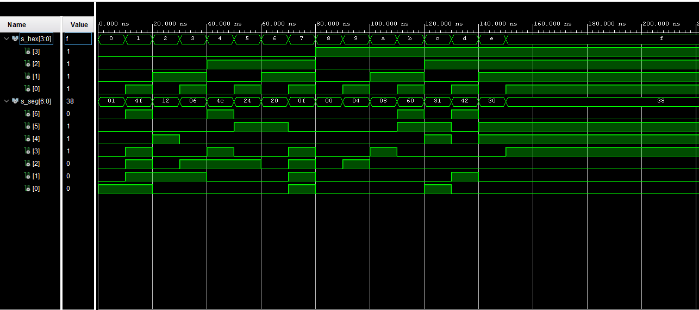

# LAB 04-segment


### Link to GitHub repository
[GitHub repository](https://github.com/amwellius/Digital-electronics-1)


## Part 1: Preparation tasks

### Figure or table with connection of 7-segment displays on Nexys A7 board
   From switches 0-15 (SW0-SW15) we are using switches SW0-SW4 <br/>
   Also using 7-seg Display <br/>
   Used Schema link: <br/>
   (https://reference.digilentinc.com/reference/programmable-logic/nexys-a7/reference-manual) <br/>
   
#### SCHEMA: <br/>


### Decoder truth table for common anode 7-segment display

| **Hex** | **Inputs** | **A** | **B** | **C** | **D** | **E** | **F** | **G** |
| :-: | :-: | :-: | :-: | :-: | :-: | :-: | :-: | :-: |
| 0 | 0000 | 0 | 0 | 0 | 0 | 0 | 0 | 1 |
| 1 | 0001 | 1 | 0 | 0 | 1 | 1 | 1 | 1 |
| 2 | 0010 | 0 | 0 | 1 | 0 | 0 | 1 | 0 |
| 3 | 0011 | 0 | 0 | 0 | 0 | 1 | 1 | 0 |
| 4 | 0100 | 1 | 0 | 0 | 1 | 1 | 0 | 0 | 
| 5 | 0101 | 0 | 1 | 0 | 0 | 1 | 0 | 0 |
| 6 | 0110 | 0 | 1 | 0 | 0 | 0 | 0 | 0 |
| 7 | 0111 | 0 | 0 | 0 | 1 | 1 | 1 | 1 |
| 8 | 1000 | 0 | 0 | 0 | 0 | 0 | 0 | 0 |
| 9 | 1001 | 0 | 0 | 0 | 0 | 1 | 0 | 0 |
| A | 1010 | 0 | 0 | 0 | 1 | 0 | 0 | 0 |
| b | 1011 | 1 | 1 | 0 | 0 | 0 | 0 | 0 |
| C | 1100 | 0 | 1 | 1 | 0 | 0 | 0 | 1 |
| d | 1101 | 1 | 0 | 0 | 0 | 0 | 1 | 0 |
| E | 1110 | 0 | 1 | 1 | 0 | 0 | 0 | 0 |
| F | 1111 | 0 | 1 | 1 | 1 | 0 | 0 | 0 |
    


## Part 2: Seven-segment display decoder
### Listing of VHDL architecture from source file hex_7seg.vhd with syntax highlighting
### VHDL CODE 
```vhdl
architecture behavioral of hex_7seg is               
begin                                                
                                                     
    -------------------------------------------------
    -- p_7seg_decoder:                               
    -- A combinational process for 7-segment display 
    -- Any time "hex_i" is changed, the process is "e
    -- Output pin seg_o(6) corresponds to segment A, 
    -------------------------------------------------
    p_7seg_decoder : process(hex_i)                  
    begin                                            
        case hex_i is                                
            when "0000" =>                           
                seg_o <= "0000001";            -- 0  
            when "0001" =>                           
                seg_o <= "1001111";            -- 1  
            when "0010" =>                           
                seg_o <= "0010010";            -- 2  
            when "0011" =>                           
                seg_o <= "0000110";            -- 3  
            when "0100" =>                           
                seg_o <= "1001100";            -- 4  
            when "0101" =>                           
                seg_o <= "0100100";            -- 5  
            when "0110" =>                           
                seg_o <= "0100000";            -- 6  
            when "0111" =>                           
                seg_o <= "0001111";            -- 7  
            when "1000" =>                           
                seg_o <= "0000000";            -- 8  
            when "1001" =>                           
                seg_o <= "0000100";            -- 9  
            when "1010" =>                           
                seg_o <= "0001000";            -- A  
            when "1011" =>                           
                seg_o <= "1100000";            -- B  
            when "1100" =>                           
                seg_o <= "0110001";            -- C  
            when "1101" =>                           
                seg_o <= "1000010";            -- D  
            when "1110" =>                           
                seg_o <= "0110000";            -- E  
            when others =>                           
                seg_o <= "0111000";            -- F  
        end case;                                    
    end process p_7seg_decoder;                      
                                                     
end architecture behavioral;                         
```

### Listing of VHDL stimulus process from testbench file tb_hex_7seg.vhd with syntax highlighting
### VHDL CODE
```vhdl
p_stimulus : process
    begin
        report "Stimulus process started" severity note;
        
        s_hex <= "0000";    wait for 10 ns;       -- 0
        s_hex <= "0001";    wait for 10 ns;       -- 1
        s_hex <= "0010";    wait for 10 ns;       -- 2
        s_hex <= "0011";    wait for 10 ns;       -- 3
        s_hex <= "0100";    wait for 10 ns;       -- 4
        s_hex <= "0101";    wait for 10 ns;       -- 5
        s_hex <= "0110";    wait for 10 ns;       -- 6
        s_hex <= "0111";    wait for 10 ns;       -- 7
        s_hex <= "1000";    wait for 10 ns;       -- 8
        s_hex <= "1001";    wait for 10 ns;       -- 9
        s_hex <= "1010";    wait for 10 ns;       -- A
        s_hex <= "1011";    wait for 10 ns;       -- B
        s_hex <= "1100";    wait for 10 ns;       -- C
        s_hex <= "1101";    wait for 10 ns;       -- D
        s_hex <= "1110";    wait for 10 ns;       -- E
        s_hex <= "1111";    wait for 10 ns;       -- F
        
    
    
        report "Stimulus process finished" severity note;
        wait;
    end process p_stimulus;

```

### Screenshot with simulated time waveforms; always display all inputs and outputs
  

### Listing of VHDL code from source file top.vhd with 7-segment module instantiation
```vhdl

```

## Part 3: LED(7:4) indicators
### LED(7:4) indicators

### Screenshot with simulated time waveforms; always display all inputs and outputs


