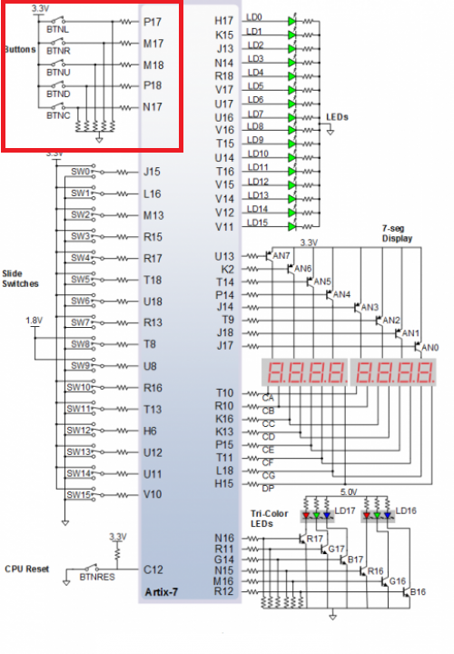
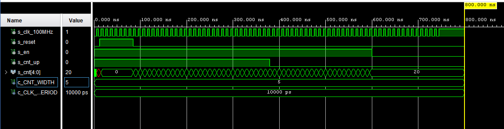
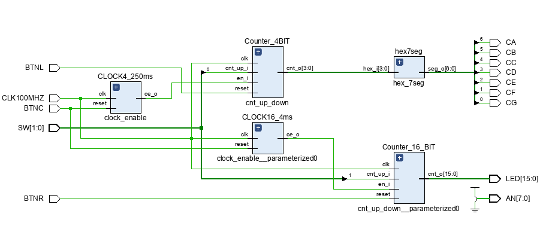

# LAB 05-counter


### Link to GitHub repository
[GitHub repository](https://github.com/amwellius/Digital-electronics-1)


## Part 1: Preparation tasks

### Figure or table with connection of push buttons on Nexys A7 board

   From switches 0-15 (SW0-SW15) we are using switches SW0-SW4 <br/>
   Also using 7-seg Display and LED[0]-LED[7] <br/>
   Used Schema link: <br/>
   (https://reference.digilentinc.com/reference/programmable-logic/nexys-a7/reference-manual) <br/>
   
#### SCHEMA: <br/>


### Table with calculated values

| **Time interval** | **Number of clk periods** | **Number of clk periods in hex** | **Number of clk periods in binary** |
| :-: | :-: | :-: | :-: |
| 2ms | 200 000 | `x"3_0D40"` | `b"0011_0000_1101_0100_0000"` |
| 4ms | 400 000 | `x"6_1A80"` | `b"0110_0001_1010_1000_0000"` |
| 10ms | 1 000 000 | `x"F_4240"` | `b"1111_0100_0010_0100_0000"` |
| 250ms | 25 000 000 | `x"17D_7840"` | `b"0001_0111_1101_0111_1000_0100_0000"` |
| 500ms | 50 000 000 | `x"2FA_F080"` | `b"0010_1111_1010_1111_0000_1000_0000"` |
| 1sec | 100 000 000 | `x"5F5_E100"` | `b"0101_1111_0101_1110_0001_0000_0000"` |
    


## Part 2: Bidirectional counter
### Listing of VHDL code of the process p_cnt_up_down with syntax highlighting
### VHDL CODE 
```vhdl
                       
```

### Listing of VHDL reset and stimulus processes from testbench file tb_cnt_up_down.vhd with syntax highlighting and asserts
### VHDL CODE
```vhdl

```

### Screenshot with simulated time waveforms; always display all inputs and outputs
  


## Part 3: Top level
### Listing of VHDL code from source file top.vhd with all instantiations for the 4-bit bidirectional counter.

```vhdl

```


### (Hand-drawn) sketch of the top layer including both counters, ie a 4-bit bidirectional counter from Part 4 and a 16-bit counter with a different time base from Part Experiments on your own



