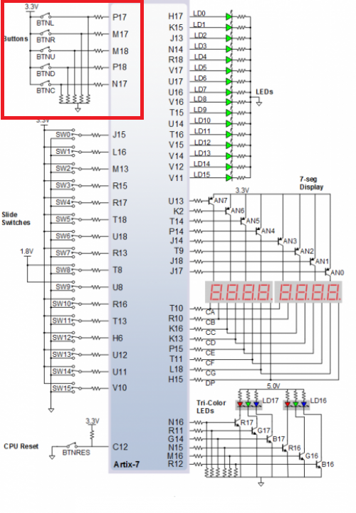
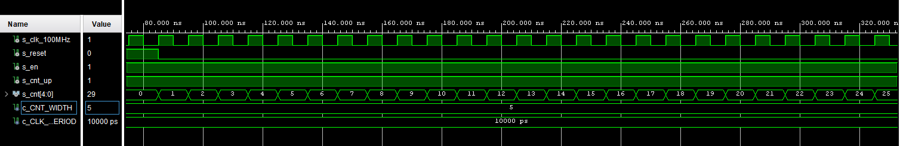
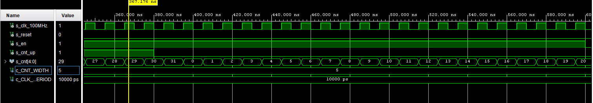

# LAB 05-counter


### Link to GitHub repository
[GitHub repository](https://github.com/amwellius/Digital-electronics-1)


## Part 1: Preparation tasks

### Figure or table with connection of push buttons on Nexys A7 board
   Using:         <br/>
   SW0-SW4        <br/>
   7-seg Display  <br/>
   LED[0]-LED[7]  <br/>
   Buttons BTNL, BTNR, BTNU, BTND, BTNC
   Used Schema link: <br/>
   (https://reference.digilentinc.com/reference/programmable-logic/nexys-a7/reference-manual) <br/>
   
#### SCHEMA: <br/>


### Table with calculated values

| **Time interval** | **Number of clk periods** | **Number of clk periods in hex** | **Number of clk periods in binary** |
| :-: | :-: | :-: | :-: |
| 2ms | 200 000 | `x"3_0D40"` | `b"0011_0000_1101_0100_0000"` |
| 4ms | 400 000 | `x"6_1A80"` | `b"0110_0001_1010_1000_0000"` |
| 10ms | 1 000 000 | `x"F_4240"` | `b"1111_0100_0010_0100_0000"` |
| 250ms | 25 000 000 | `x"17D_7840"` | `b"0001_0111_1101_0111_1000_0100_0000"` |
| 500ms | 50 000 000 | `x"2FA_F080"` | `b"0010_1111_1010_1111_0000_1000_0000"` |
| 1sec | 100 000 000 | `x"5F5_E100"` | `b"0101_1111_0101_1110_0001_0000_0000"` |
    


## Part 2: Bidirectional counter
### Listing of VHDL code of the process p_cnt_up_down with syntax highlighting
### VHDL CODE 
```vhdl
  p_cnt_up_down : process(clk)
    begin
        if rising_edge(clk) then
      --if falling_edge(clk) then
        
            if (reset = '1') then               -- Synchronous reset
                s_cnt_local <= (others => '0'); -- Clear all bits
            elsif (en_i = '1') then       -- Test if counter is enabled
                if (cnt_up_i = '1') then
                    s_cnt_local <=  s_cnt_local +1;
                else    s_cnt_local <= s_cnt_local -1;
                end if; 
                s_cnt_local <= s_cnt_local + 1;
            end if;
        end if;
    end process p_cnt_up_down;
                      
```

### Listing of VHDL reset and stimulus processes from testbench file tb_cnt_up_down.vhd with syntax highlighting and asserts
### VHDL CODE
```vhdl
  p_reset_gen : process
    begin
        s_reset <= '0';
        wait for 12 ns;        
        -- Reset activated
        s_reset <= '1';
        wait for 73 ns;
        s_reset <= '0';
        wait;
        
    end process p_reset_gen;

    --------------------------------------------------------------------
    -- Data generation process
    --------------------------------------------------------------------
    p_stimulus : process
    begin
        report "Stimulus process started" severity note;

        -- Enable counting
        s_en     <= '1';
        
        -- Change counter direction
        s_cnt_up <= '1';
        wait for 380 ns;
        s_cnt_up <= '0';
        wait for 220 ns;
        -- Disable counting
        s_en     <= '0';

        report "Stimulus process finished" severity note;
        wait;
    end process p_stimulus;

```

### Screenshot with simulated time waveforms; always display all inputs and outputs
  
 
 


## Part 3: Top level
### Listing of VHDL code from source file top.vhd with all instantiations for the 4-bit bidirectional counter.

```vhdl
architecture Behavioral of top is

    -- Internal clock enable
    signal s_en  : std_logic;
    -- Internal counter
    signal s_cnt : std_logic_vector(4 - 1 downto 0);

begin

    --------------------------------------------------------------------
    -- Instance (copy) of clock_enable entity
    clk_en0 : entity work.clock_enable
        generic map(
            g_MAX   => 100000000
        )
        port map(
             clk    =>  CLK100MHZ,
             reset  =>  BTNC,
             ce_o   =>  s_en
        );

    --------------------------------------------------------------------
    -- Instance (copy) of cnt_up_down entity
    bin_cnt0 : entity work.cnt_up_down
        generic map(
            g_CNT_WIDTH =>  4
        )
        port map(
            clk         => CLK100MHZ,  
            reset       => BTNC,
            en_i        => s_en,    
            cnt_up_i    => SW(0),
            cnt_o       => s_cnt
        );

    -- Display input value on LEDs
    LED(3 downto 0) <= s_cnt;

    --------------------------------------------------------------------
    -- Instance (copy) of hex_7seg entity
    hex2seg : entity work.hex_7seg
        port map(
            hex_i    => s_cnt,
            seg_o(6) => CA,
            seg_o(5) => CB,
            seg_o(4) => CC,
            seg_o(3) => CD,
            seg_o(2) => CE,
            seg_o(1) => CF,
            seg_o(0) => CG
        );

    -- Connect one common anode to 3.3V
    AN <= b"1111_1110";

end architecture Behavioral;
```


### (Hand-drawn) sketch of the top layer including both counters, ie a 4-bit bidirectional counter from Part 4 and a 16-bit counter with a different time base from Part Experiments on your own


