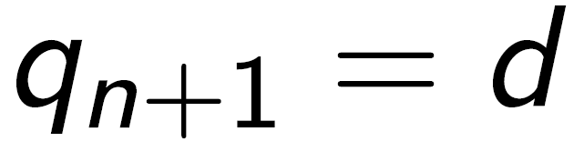
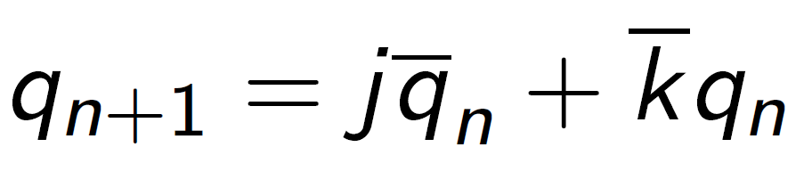
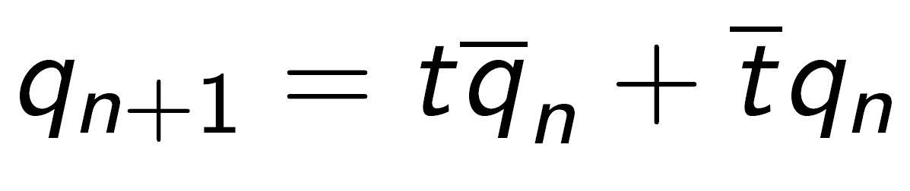
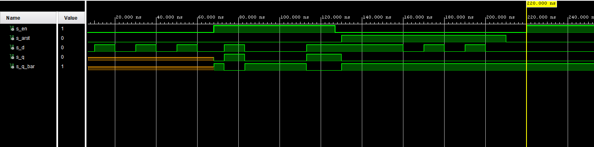
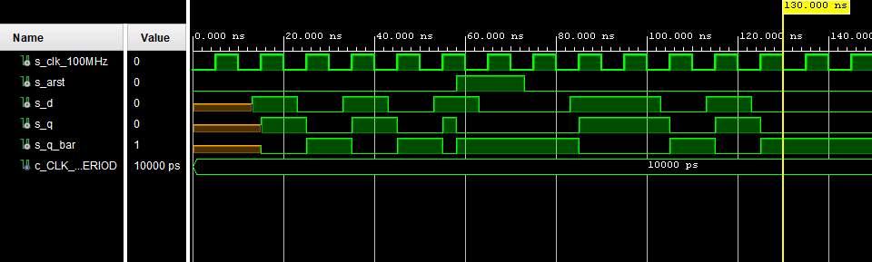
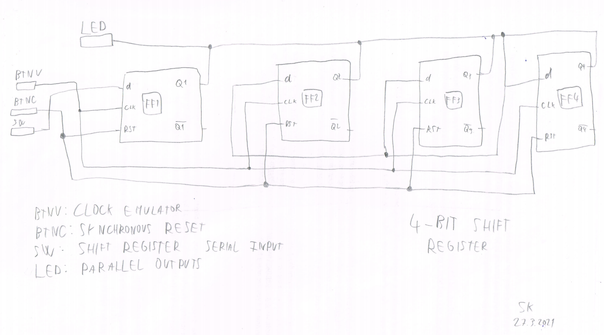

# LAB 07-ffs


### Link to GitHub repository
[GitHub repository](https://github.com/amwellius/Digital-electronics-1)


## Part 1: Preparation tasks

### Characteristic equations and completed tables for D, JK, T flip-flops
#### Equations done using: [](https://www.codecogs.com/latex/eqneditor.php)
#### Tables
 
   | **D** | **Qn** | **Q(n+1)** | **Comments** |
   | :-: | :-: | :-: | :-- |
   | 0 | 0 | 0 | No change |
   | 0 | 1 | 0 | Change |
   | 1 | 1 | 0 | No change |
   | 1 | 0 | 0 | Change |
   
   ##### EQ
   

   | **J** | **K** | **Qn** | **Q(n+1)** | **Comments** |
   | :-: | :-: | :-: | :-: | :-- |
   | 0 | 0 | 0 | 0 | No change |
   | 0 | 0 | 1 | 1 | No change |
   | 0 | 1 | 0 | 0 | Reset |
   | 0 | 1 | 1 | 0 | Reset |
   | 1 | 0 | 0 | 1 | Set |
   | 1 | 0 | 1 | 1 | Set |
   | 1 | 1 | 0 | 1 | Toogle (invert) |
   | 1 | 1 | 1 | 0 | Toogle (invert) |
   
   ##### EQ
   

   | **T** | **Qn** | **Q(n+1)** | **Comments** |
   | :-: | :-: | :-: | :-- |
   | 0 | 0 | 0 | No change |
   | 0 | 1 | 1 | No change |
   | 1 | 0 | 1 | Invert |
   | 1 | 1 | 0 | Invert |
   
   ##### EQ
   
   
#### Signals: <br/>

#### Used Schema: <br/>


## Part 2: D latch
### VHDL code listing of the process p_d_latch with syntax highlighting
### VHDL CODE 
```vhdl

```

### Listing of VHDL reset and stimulus processes from the testbench tb_d_latch file with syntax highlighting and asserts
### VHDL CODE
```vhdl
  
```

### Screenshot with simulated time waveforms; always display all inputs and outputs. The full functionality of the entity must be verified
  
 


## Part 3: Flip-flops
### VHDL code listing of the processes p_d_ff_arst, p_d_ff_rst, p_jk_ff_rst, p_t_ff_rst with syntax highlighting
### VHDL CODE 
```vhdl

```

### Listing of VHDL clock, reset and stimulus processes from the testbench files with syntax highlighting and asserts
### VHDL CODE 
```vhdl

```
### Screenshot, with simulated time waveforms; always display all inputs and outputs. The full functionality of the entities must be verified



## Part 4: Shift register
### Image of the shift register schematic. The image can be drawn on a computer or by hand. Name all inputs, outputs, components and internal signals

### MAP using RTL Analysis in VIVADO



