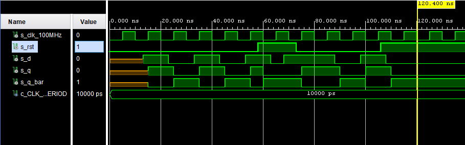
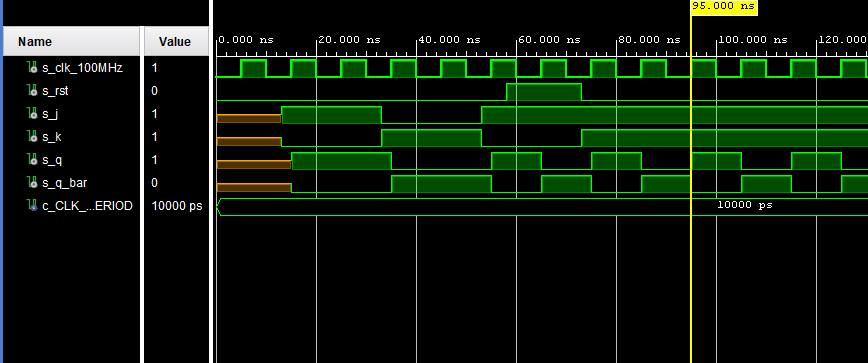
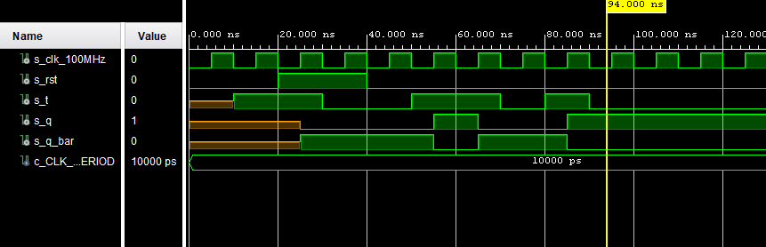

# LAB 07-ffs


### Link to GitHub repository
[GitHub repository](https://github.com/amwellius/Digital-electronics-1)


## Part 1: Preparation tasks

### Characteristic equations and completed tables for D, JK, T flip-flops
#### Equations made using: https://www.codecogs.com/latex/eqneditor.php
#### Tables
 
   | **D** | **Qn** | **Q(n+1)** | **Comments** |
   | :-: | :-: | :-: | :-- |
   | 0 | 0 | 0 | No change |
   | 0 | 1 | 0 | Change |
   | 1 | 1 | 0 | No change |
   | 1 | 0 | 0 | Change |
   
   ##### EQ
   

   | **J** | **K** | **Qn** | **Q(n+1)** | **Comments** |
   | :-: | :-: | :-: | :-: | :-- |
   | 0 | 0 | 0 | 0 | No change |
   | 0 | 0 | 1 | 1 | No change |
   | 0 | 1 | 0 | 0 | Reset |
   | 0 | 1 | 1 | 0 | Reset |
   | 1 | 0 | 0 | 1 | Set |
   | 1 | 0 | 1 | 1 | Set |
   | 1 | 1 | 0 | 1 | Toogle (invert) |
   | 1 | 1 | 1 | 0 | Toogle (invert) |
   
   ##### EQ
   

   | **T** | **Qn** | **Q(n+1)** | **Comments** |
   | :-: | :-: | :-: | :-- |
   | 0 | 0 | 0 | No change |
   | 0 | 1 | 1 | No change |
   | 1 | 0 | 1 | Invert |
   | 1 | 1 | 0 | Invert |
   
   ##### EQ
   


## Part 2: D latch
### VHDL code listing of the process p_d_latch with syntax highlighting
### VHDL CODE 
```vhdl
 p_d_latch : process (d, arst, en)  --toto je ta tabulka vlastne
    begin
        if (arst = '1') then
             q      <= '0';
             q_bar  <= '1';
        elsif (en = '1') then
           q      <= d;
           q_bar   <= not d;
        end if;
 end process p_d_latch;
```

### Listing of VHDL reset and stimulus processes from the testbench tb_d_latch file with syntax highlighting and asserts
### VHDL CODE
```vhdl
 p_reset_gen : process 
    begin
        s_arst <= '0';
        wait for 20 ns;        

        s_arst <= '1';
        wait for 10 ns;

        s_arst <= '0';
        wait for 109 ns;
        s_arst <= '1';   
        
        wait;
    end process p_reset_gen;

    --------------------------------------------------------------------
    -- Data generation process
    --------------------------------------------------------------------
    p_stimulus : process
    begin
        report "Stimulus process started" severity note;
        s_en    <= '0';
        s_d     <= '0';
        --s_arst  <= '0';


        wait for 10 ns; s_d <= '1';
        wait for 10 ns; s_d <= '0';
        wait for 10 ns; s_d <= '1';
        wait for 10 ns; s_d <= '0';
        wait for 10 ns; s_d <= '1';
        wait for 10 ns; s_d <= '0';
        wait for 8 ns;

        s_en <= '1'; wait for 5 ns;
        assert(s_q = '0' and s_q_bar = '1') --ak to neni nula vypise sa to co je v tom reporte
        report " s_q and q_bar expected 01" severity error;
        
        s_d <= '1';
        wait for 10 ns; s_d <= '0';
        wait for 10 ns; s_d <= '0';
        wait for 10 ns; s_d <= '0';
        wait for 10 ns; s_d <= '1';
        wait for 10 ns; s_d <= '1';
        wait for 4 ns; s_d <= '1';
        
        s_en <= '0'; wait for 3 ns;
       -- s_arst <= '1'; wait for 10 ns;
        assert(s_q = '1' and s_q_bar = '0') 
        report " asrt expected 1" severity error;
        
        wait for 10 ns; s_d <= '1';
        wait for 10 ns; s_d <= '0';
        wait for 10 ns; s_d <= '1';
        wait for 10 ns; s_d <= '0';
        wait for 10 ns; s_d <= '1';
        wait for 10 ns; s_d <= '0';
        wait for 10 ns; s_d <= '0';
        
        --s_arst <= '0'; wait for 10 ns;
        
        s_en <= '1'; wait for 10 ns;
        assert(s_q = '0' and s_q_bar = '1') 
        report " asrt expected 1" severity error
     
        report "Stimulus process finished" severity note;
        
        wait;
    end process p_stimulus;
```

### Screenshot with simulated time waveforms; always display all inputs and outputs. The full functionality of the entity must be verified
  


## Part 3: Flip-flops
### VHDL code listing of the processes p_d_ff_arst, p_d_ff_rst, p_jk_ff_rst, p_t_ff_rst with syntax highlighting
### VHDL CODE 'p_d_ff_arst'
```vhdl
p_d_ff_arst : process (clk, arst)  --toto je ta tabulka vlastne    --proces sa spusti pri kazdej zmene hrany
 begin                                                              
     if (arst = '1') then     --rovnake ako d_latch                                      
         q <= '0';                                                  
         q_bar <= '1';                                              
     elsif rising_edge(clk) then                                          
         q <= d;                                                    
         q_bar <= not d;                                            
     end if;                                                        
 end process p_d_ff_arst; 
```

### Listing of VHDL clock, reset and stimulus processes from the testbench files with syntax highlighting and asserts
### VHDL CODE 'd_ff_arst'
```vhdl
 p_clk_gen : process
    begin
        while now < 750 ns loop         -- 75 periods of 100MHz clock
            s_clk_100MHz <= '0';
            wait for c_CLK_100MHZ_PERIOD / 2;
            s_clk_100MHz <= '1';
            wait for c_CLK_100MHZ_PERIOD / 2;
        end loop;
        wait;                           -- Process is suspended forever
    end process p_clk_gen;
    
    --------------------------------------------------------------------
    -- Reset generation process
    --------------------------------------------------------------------
    p_reset_gen : process 
    begin
        s_arst <= '0';
        wait for 58 ns;
        
        -- Reset activated
        s_arst <= '1';
        wait for 15 ns;

        -- Reset deactivated
        s_arst <= '0';
                
        wait;
    end process p_reset_gen;
    
    -------------------------------------------------------------------
    -- Data generation process
    --------------------------------------------------------------------
    p_stimulus : process
    begin
        report "Stimulus process started" severity note;
        
        wait for 13 ns; s_d <= '1';
        assert(s_q = '0' and s_q_bar = '1') 
        report " Error, s_q / s_q_bar not as expected" severity error;
        
        wait for 10 ns; s_d <= '0';
        assert(s_q = '0' and s_q_bar = '1') 
        report " Error, s_q / s_q_bar not as expected" severity error;
        
        wait for 10 ns; s_d <= '1';
        wait for 10 ns; s_d <= '0';
        wait for 10 ns; s_d <= '1';
        assert(s_q = '0' and s_q_bar = '1') 
        report " Error, s_q / s_q_bar not as expected" severity error;
        
        wait for 10 ns; s_d <= '0';
        wait for 10 ns; s_d <= '0';
        assert(s_q = '1' and s_q_bar = '0') 
        report " Error, s_q / s_q_bar not as expected" severity error;
        
        wait for 10 ns; s_d <= '1';
        wait for 10 ns; s_d <= '1';
        wait for 10 ns; s_d <= '0';
        wait for 10 ns; s_d <= '1';
        wait for 10 ns; s_d <= '0';
 
        report "Stimulus process finished" severity note;        
        wait;
    end process p_stimulus;
```
### Screenshot, with simulated time waveforms; always display all inputs and outputs. The full functionality of the entities must be verified


### VHDL CODE 'p_d_ff_rst'
```vhdl
 p_d_ff_rst : process (clk)  
 begin                                                              
     if (rst = '1') then                                         
         q <= '0';                                                  
         q_bar <= '1';                                              
     else                                          
         q <= d;                                                    
         q_bar <= not d;                                            
     end if;   
 end process p_d_ff_rst;   
```

### Listing of VHDL clock, reset and stimulus processes from the testbench files with syntax highlighting and asserts
### VHDL CODE 'd_ff_rst'
```vhdl
 p_clk_gen : process
    begin
        while now < 750 ns loop         -- 75 periods of 100MHz clock
            s_clk_100MHz <= '0';
            wait for c_CLK_100MHZ_PERIOD / 2;
            s_clk_100MHz <= '1';
            wait for c_CLK_100MHZ_PERIOD / 2;
        end loop;
        wait;                           -- Process is suspended forever
    end process p_clk_gen;
    
    --------------------------------------------------------------------
    -- Reset generation process
    --------------------------------------------------------------------
    p_reset_gen : process 
    begin
        s_rst <= '0';
        wait for 58 ns;
        
        -- Reset activated
        s_rst <= '1';
        wait for 15 ns;

        -- Reset deactivated
        s_rst <= '0';
        wait for 33 ns;
        s_rst <= '1';
                
        wait;
    end process p_reset_gen;
    
    -------------------------------------------------------------------
    -- Data generation process
    --------------------------------------------------------------------
    p_stimulus : process
    begin
        report "Stimulus process started" severity note;
        
        wait for 13 ns; s_d <= '1';
        assert(s_q = '0' and s_q_bar = '1') 
        report " Error, s_q / s_q_bar not as expected" severity error;
        
        wait for 10 ns; s_d <= '0';
        assert(s_q = '0' and s_q_bar = '1') 
        report " Error, s_q / s_q_bar not as expected" severity error;
        
        wait for 10 ns; s_d <= '1';
        wait for 10 ns; s_d <= '0';
        wait for 10 ns; s_d <= '1';
        assert(s_q = '0' and s_q_bar = '1') 
        report " Error, s_q / s_q_bar not as expected" severity error;
        
        wait for 10 ns; s_d <= '0';
        wait for 4 ns; s_d <= '0';
        assert(s_q = '1' and s_q_bar = '0') 
        report " Error, s_q / s_q_bar not as expected" severity error;
        
        wait for 1 ns; s_d <= '1';
        wait for 10 ns; s_d <= '1';
        wait for 10 ns; s_d <= '0';
        wait for 10 ns; s_d <= '1';
        wait for 10 ns; s_d <= '0';
 
        report "Stimulus process finished" severity note;        
        wait;
    end process p_stimulus;
```
### Screenshot, with simulated time waveforms; always display all inputs and outputs. The full functionality of the entities must be verified


### VHDL CODE 'p_jk_ff_rst'
```vhdl
 p_jk_ff_rst : process (clk)  
 begin                                                              
                                     
     if rising_edge(clk) then  
          if (rst = '1') then
              s_q <= '0';
          else
            if (j = '0' and k = '0') then
                s_q <= s_q;
            elsif (j = '0' and k = '1') then
                s_q <= '0';
            elsif (j = '1' and k = '0') then
                s_q <= '1';
            elsif (j = '1' and k = '1') then 
                s_q <= not s_q;
            end if;       
                
          end if;                           
                                       
     end if;                                                        
 end process p_jk_ff_rst;                                             
    
    q       <= s_q;
    q_bar   <= not s_q;

```

### Listing of VHDL clock, reset and stimulus processes from the testbench files with syntax highlighting and asserts
### VHDL CODE 'jk_ff_rst'
```vhdl
 p_clk_gen : process
    begin
        while now < 750 ns loop         -- 75 periods of 100MHz clock
            s_clk_100MHz <= '0';
            wait for c_CLK_100MHZ_PERIOD / 2;
            s_clk_100MHz <= '1';
            wait for c_CLK_100MHZ_PERIOD / 2;
        end loop;
        wait;                           -- Process is suspended forever
    end process p_clk_gen;
    
    --------------------------------------------------------------------
    -- Reset generation process
    --------------------------------------------------------------------
    p_reset_gen : process 
    begin
        s_rst <= '0';
        wait for 58 ns;
        
        -- Reset activated
        s_rst <= '1';
        wait for 15 ns;

        -- Reset deactivated
        s_rst <= '0';
        wait for 108 ns;      
        
            
        wait;
    end process p_reset_gen;
    
    -------------------------------------------------------------------
    -- Data generation process
    --------------------------------------------------------------------
    p_stimulus : process
    begin
        report "Stimulus process started" severity note;
        
        wait for 13 ns;
        s_j <= '1';
        s_k <= '0';
        wait for 20 ns;
        assert(s_q = '1' and s_q_bar = '0') 
        report " Error, s_q / s_q_bar not as expected" severity error;
    --    
        s_j <= '0';
        s_k <= '1';
        wait for 20 ns;
        assert(s_q = '0' and s_q_bar = '1') 
        report " Error, s_q / s_q_bar not as expected" severity error;
        
        s_j <= '1';
        s_k <= '0';
        wait for 20 ns;
        assert(s_q = '0' and s_q_bar = '1') 
        report " Error, s_q / s_q_bar not as expected" severity error;
        
        s_j <= '1';
        s_k <= '1';
        wait for 10 ns;
        assert(s_q = '1' and s_q_bar = '0') 
        report " Error, s_q / s_q_bar not as expected" severity error;
        
        s_j <= '1';
        s_k <= '1';
        wait for 10 ns;
        assert(s_q = '0' and s_q_bar = '1') 
        report " Error, s_q / s_q_bar not as expected" severity error;
        
        s_j <= '1';
        s_k <= '1';
        wait for 10 ns;
        assert(s_q = '1' and s_q_bar = '0') 
        report " Error, s_q / s_q_bar not as expected" severity error;
        report "Stimulus process finished" severity note;
   --     
        wait;
    end process p_stimulus;

```
### Screenshot, with simulated time waveforms; always display all inputs and outputs. The full functionality of the entities must be verified


### VHDL CODE 'p_t_ff_rst'
```vhdl
p_t_ff_rst : process (clk)  
 begin                                                              
                                     
     if rising_edge(clk) then  
          if (rst = '1') then
              s_q <= '0';
          else
            if (t = '0' ) then
                s_q <= s_q;
            else
                s_q <= not s_q;
            end if;                    
          end if;
     end if;                       
 end process p_t_ff_rst;                                             
    
    q       <= s_q;
    q_bar   <= not s_q;

```

### Listing of VHDL clock, reset and stimulus processes from the testbench files with syntax highlighting and asserts
### VHDL CODE 't_ff_rst'
```vhdl
p_clk_gen : process
    begin
        while now < 750 ns loop         -- 75 periods of 100MHz clock
            s_clk_100MHz <= '0';
            wait for c_CLK_100MHZ_PERIOD / 2;
            s_clk_100MHz <= '1';
            wait for c_CLK_100MHZ_PERIOD / 2;
        end loop;
        wait;                           -- Process is suspended forever
    end process p_clk_gen;
    
    --------------------------------------------------------------------
    -- Reset generation process
    --------------------------------------------------------------------
    p_reset_gen : process 
    begin
        s_rst <= '0';
        wait for 20 ns;
        
        -- Reset activated
        s_rst <= '1';
        wait for 20 ns;

        -- Reset deactivated
        s_rst <= '0';
        wait for 71 ns;      
        
            
        wait;
    end process p_reset_gen;
    
    -------------------------------------------------------------------
    -- Data generation process
    --------------------------------------------------------------------
    p_stimulus : process
    begin
        report "Stimulus process started" severity note;
        
        wait for 10 ns;
        s_t <= '1';
        wait for 20 ns;
        assert(s_q = '1' and s_q_bar = '0') 
        report " Error, s_q / s_q_bar not as expected" severity error;
    --    
        s_t <= '0';
        wait for 20 ns;
        assert(s_q = '1' and s_q_bar = '1') 
        report " Error, s_q / s_q_bar not as expected" severity error;
        
        s_t <= '1';
        wait for 20 ns;
        assert(s_q = '0' and s_q_bar = '1') 
        report " Error, s_q / s_q_bar not as expected" severity error;
        
        s_t <= '0';
        wait for 10 ns;
        assert(s_q = '1' and s_q_bar = '0') 
        report " Error, s_q / s_q_bar not as expected" severity error;
        
        s_t <= '1';
        wait for 10 ns;
        assert(s_q = '1' and s_q_bar = '0') 
        report " Error, s_q / s_q_bar not as expected" severity error;
        
        s_t <= '0';
         wait for 10 ns;
        assert(s_q = '1' and s_q_bar = '0') 
        report " Error, s_q / s_q_bar not as expected" severity error;
        
        s_t <= '0';
         wait for 1 ns;
        assert(s_q = '1' and s_q_bar = '0') 
        report " Error, s_q / s_q_bar not as expected" severity error;
        
        report "Stimulus process finished" severity note;
   --     
        wait;
    end process p_stimulus;

```
### Screenshot, with simulated time waveforms; always display all inputs and outputs. The full functionality of the entities must be verified



## Part 4: Shift register
### Image of the shift register schematic. The image can be drawn on a computer or by hand. Name all inputs, outputs, components and internal signals

### MAP using RTL Analysis in VIVADO


