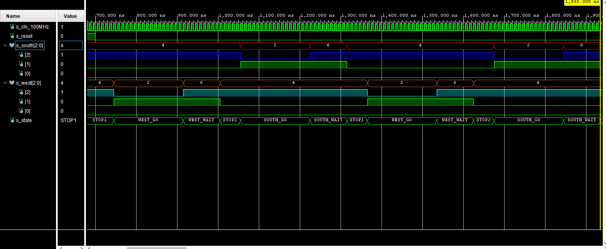

# LAB 08-traffic_lights


### Link to GitHub repository
[GitHub repository](https://github.com/amwellius/Digital-electronics-1)


## Part 1: Preparation tasks

### Completed state table


### Figure with connection of RGB LEDs on Nexys A7 board and completed table with color settings

   


## Part 2: Traffic light controller
### Listing of VHDL code of sequential process p_traffic_fsm with syntax highlighting
### VHDL CODE 
```vhdl

```

### Listing of VHDL code of combinatorial process p_output_fsm with syntax highlighting
### VHDL CODE
```vhdl
 
```

### Screenshot(s) of the simulation, from which it is clear that controller works correctly
  


## Part 3: Smart controller
### State table

### State diagram

### Listing of VHDL code of sequential process p_smart_traffic_fsm with syntax highlighting
### VHDL CODE 
```vhdl


```


